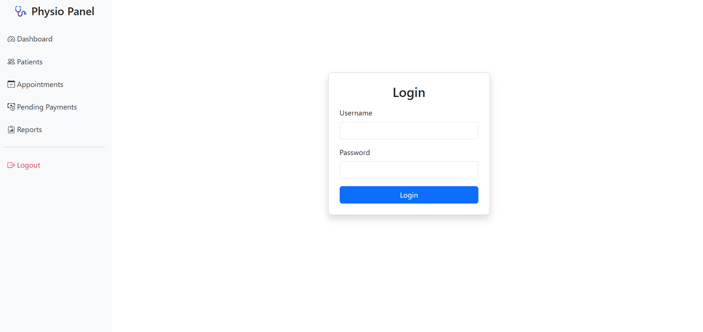
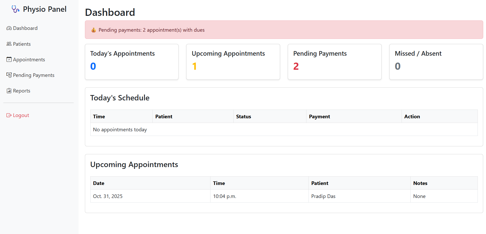
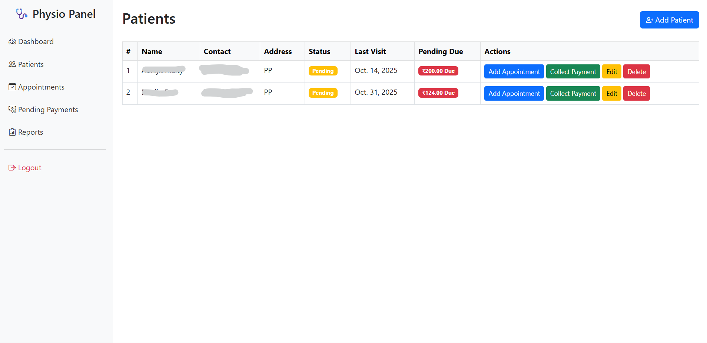
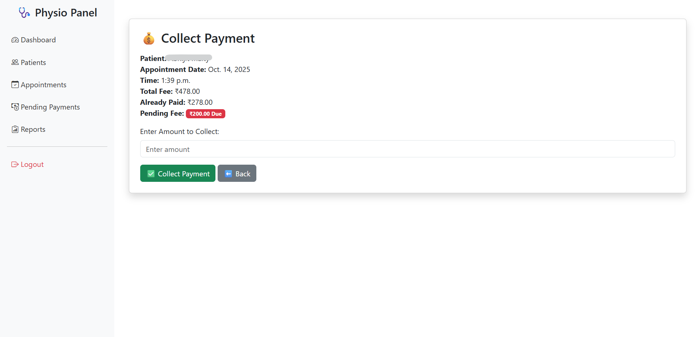
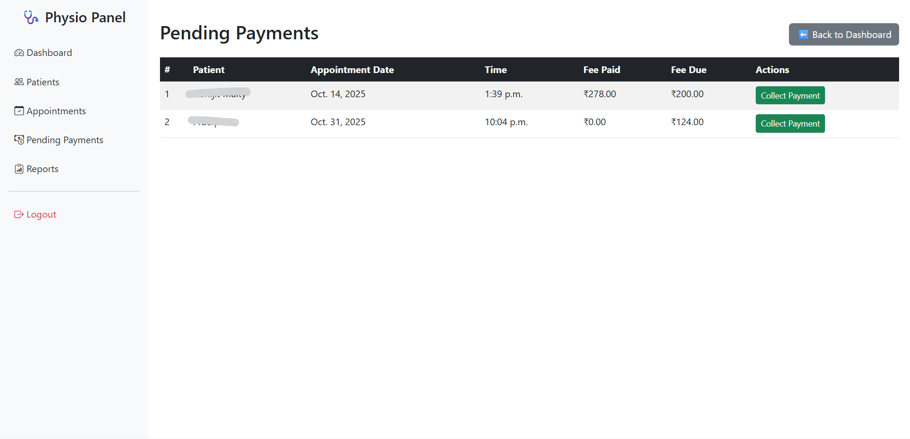

# 🏥 Django Clinic Management System

A lightweight clinic management application built with **Django + Bootstrap**.  
This system allows doctors/clinic admins to manage:

✔ Patients  
✔ Appointments  
✔ Payment Collection (with due tracking)  
✔ Pending Payments Report  
✔ Secure Login (only from Django Admin created accounts)

---

## 🚀 Features

| Module              | Description |
|-------------------|-------------|
| 👤 Patient Management | Add, edit, delete, and track patients with pending fees |
| 📅 Appointments      | Add/view all appointments for patients |
| 💵 Payment Collection | Collect fees, update pending dues automatically |
| ⏳ Pending Payments  | View all patients with outstanding payments |
| 🔐 Authentication    | Secure login (only admin-created users can access dashboard) |
| 📊 Dashboard         | Quick access to modules after login |

---

## 🖼️ Screenshots

| Screenshot | Preview |
|-----------|--------|
| 🏠 Login Page |  |
| 📊 Dashboard |  |
| 👤 Patients List |  |
| 💵 Collect Payment |  |
| 🧾 Pending Payments |  |

> 👉 **Create a folder named `screenshots/` in the root of the project and place your images there** with the exact names above.

---

## 📁 Project Structure

clinic_management/
│
├── clinic_app/
│ ├── templates/
│ │ ├── base.html
│ │ ├── home.html (Login Page)
│ │ ├── dashboard.html
│ │ ├── patients/
│ │ ├── payments/
│ │ ├── appointments/
│ ├── views.py
│ ├── models.py
│ ├── urls.py
│
├── clinic_management/ (Main Django Settings Folder)
├── manage.py
├── requirements.txt
├── README.md ✅ (You are here)
└── screenshots/ 📂 (Add your images here)


---

## ⚙️ Installation & Setup

```bash
# 1️⃣ Clone the repo
git clone https://github.com/SudipBera083/Smart-Physiotherapy-Patient-Schedule-Management-System.git
cd physio_app

# 2️⃣ Create Virtual Environment (optional but recommended)
python -m venv env
source env/bin/activate  # On Windows: env\Scripts\activate

# 3️⃣ Install dependencies
pip install -r requirements.txt

# 4️⃣ Apply migrations
python manage.py migrate

# 5️⃣ Create superuser (for login)
python manage.py createsuperuser

# 6️⃣ Run server
python manage.py runserver
